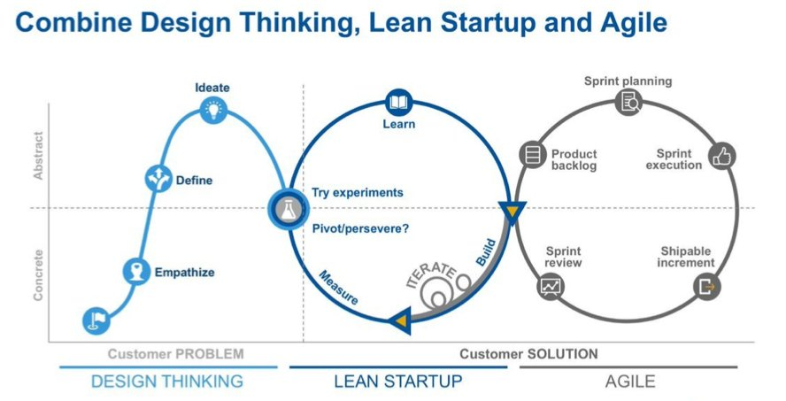

Hello! All my startup resources and bookmarks here!

## Startup Mega Resource Lists
- [101 Essential Online Business Tools](https://www.ryrob.com/side-business-resources/)

## Lean Methodology

## Fundraising - What VCs look for before they invest?
- VCs want you to demonstrate that there’s a big market for what you’re selling, and big bucks being spent in that market
- VCs want you to show how your product is different from what’s out there. What makes it unique?
- VCs want you to prove that you have a solid management team in place.
- VCs want you to show how your company is a good fit for their investment philosophy.
- VCs want you to be able to back up whatever you tell them with metrics and solid evidence.
- VCs want you to be able to explain how you are going to use their money.

## CTO Resources
- [Cookbook for Mobile Apps](https://www.slideshare.net/mrjain/startup-engineering-cookbook-for-mobile-apps)

## Chrome Plugins
- https://github.com/igrigorik/videospeed - HTML5 video speed controller : increase vidoe speeds on YT, Netflix, etc
- https://chrome.google.com/webstore/detail/the-great-suspender/klbibkeccnjlkjkiokjodocebajanakg - The Great Suspender
- https://chrome.google.com/webstore/detail/ublock-origin/cjpalhdlnbpafiamejdnhcphjbkeiagm - uBlock Origin
- https://chrome.google.com/webstore/detail/dark-reader/eimadpbcbfnmbkopoojfekhnkhdbieeh - Dark Reader
- https://chrome.google.com/webstore/detail/save-to-pocket/niloccemoadcdkdjlinkgdfekeahmflj - Save to Pocket (for all Pocket users)

## Business Templates
- https://www.hubspot.com/business-templates/ - 45 professional templates from Hubspot

## Design Resources and Tools
- https://www.evernote.design - AIO bookmarks for designers!!!
- https://iconscout.com - Free and Premium Icons
- https://www.materialpalette.com/ - Material Design and Colour Palette Creator
- https://thenounproject.com/ - Icons for everything
- https://www.pexels.com/ - Free Stock photos
- https://www.checklist.design/ - A collection of the best UX and UI practices
- [Adobe Colour](https://color.adobe.com/create) - a great site for discovering colours that work!
- [UX Templates](https://www.userexperience.guide/ux-collections/ux-templates/)

## Developer Resources and Tools
- https://getbootstrap.com/ - Bootstrap Website
- https://purecss.io/ - A set of small, responsive CSS modules that you can use in every web project
- https://cssgradientbutton.com/ - Button creator with CSS and gradient
- https://materializecss.com/ - Material design based frontend framework
- https://facebook.github.io/react-native/docs/getting-started.html - React Native Website
- http://validator.w3.org/ - Markup validation service
- https://regex101.com/ - Online Regex Checker tool

## Developer - Python Resources
- https://stxnext.com/blog/2019/06/17/top-10-blogs-python/ - List of Top 10 Python blogs
- [Google Python Style Guide](https://google.github.io/styleguide/pyguide.html)
- [Pep8 Style Guide](https://www.python.org/dev/peps/pep-0008/)

## Developer Testing Resources
- https://geekflare.com/application-automation-tools/ - Summary of automated testing tools
- https://www.seleniumhq.org/ - though the IDE seems to be dead, still the most popular tool
- https://www.katalon.com/ - free testing GUI based tool with tons of features
- https://smartbear.com/product/testcomplete/overview/ - TestComplete - an Automated UI Testing Tool
- http://appium.io/ - Appium is a free mobile automation testing tool which integrates with Selenium

- https://dzone.com/articles/comparing-top-10-cross-browser-testing-tools-in-20 - Summary of cross browser testing tools
- https://www.browserstack.com/ - for app and browser testing
- https://www.lambdatest.com/

## DevOps Resources and Tools
- https://intodns.com/ - check DNS and mail servers
- https://www.dareboost.com/en - website speed test and analysis
- https://www.webpagetest.org/ - website performance test and analysis
- https://website.grader.com/ - website grader
- https://ipv6-test.com/ - IPv6 testing site
- https://tools.geekflare.com/toolbox - site testing tools

## Excel Tools and Links
- https://exinfm.com/free_spreadsheets.html - Amazing list of free Excel spreadsheets

## Google Apps Settings
- [Catch-all for Gmail](https://blog.macaulaygidado.com/do-you-know-how-to-configure-catch-all-routing-on-g-suite-80d6327b9058)

## Google Analytics / Tag Manager Settings
- [Use Google Tag Manager to maintain Google Analytics](https://www.freecodecamp.org/news/how-to-use-google-tag-manager-to-maintain-google-analytics-and-other-marketing-tags/)
- [GTM Container Collection](https://www.bounteous.com/insights/?category=resources/google-recipes/google-tag-manager&secondary_category=All)
- [GTM Plugin Collection](https://online-metrics.com/google-tag-manager-extensions/)

## Marketing Tools and Resources
- [Intro to Branding and Brand Mgmt](https://www.slideshare.net/momarmorsi/intro-to-branding-brand-management-elkottab)
- [Flying Saucer Agency Resources](https://hello.flyingsaucer.nyc/flying-saucer-studio-resources)

## SEO Tools
- https://github.com/marcobiedermann/search-engine-optimization - Comprehensive list of SEO tools
- https://seorch.eu/ - SEOrch : OnPage SEO Tool and SEO Check
- https://neilpatel.com/backlinks/ - Backlinks
- https://neilpatel.com/ubersuggest/ - Ubersuggest : Free Keyword tool by Neil Patel
- https://neilpatel.com/seo-analyzer/ - SEO Analyzer
- https://analytics.fastbase.com/# - web leads tracker
- https://keywordshitter.com/ - Keyword research tool
- https://ads.google.com/aw/keywordplanne - Keyword planner
- https://www.crazyegg.com - Heatmap generator for websites
- [Keyword Density Analyzer](http://tools.seobook.com/general/keyword-density/)

* Blog posts/articles worth checking out
	- https://backlinko.com/increase-website-traffic
	- https://backlinko.com/content-strategy
	- https://backlinko.com/email-outreach-study
	- https://backlinko.com/ecommerce-seo
	- https://backlinko.com/conversion-rate-optimization
	- [Page Speed Stats](https://backlinko.com/page-speed-stats)
	- https://backlinko.com/get-youtube-views
	- [21 Ways to Promote Your Blob](https://backlinko.com/promote-your-blog)
	- https://www.bloggersidekick.com/how-to-write-blog-content/
	- https://www.bloggersidekick.com/how-to-get-backlinks/
	- https://flypchart.co/how-to-get-more-traffic-to-your-blog/

## SEO Contd - Finding the right keywords
- Build customer Personas
- Go to where they hang out online and find out what they discuss.
- Look at long tail keywords in the search bar + long tail keywords at bottom on page 1 of your search results + Quora
- Research keyword volume at semrush.com and https://kwfinder.com/
- Examine growth of keywords in google trends

- Source: https://neilpatel.com/blog/right-keywords-seo/
- Start with Ubersuggest - https://neilpatel.com/ubersuggest/
- What you’ll want to look for are keywords that have high paid difficulty, which means the keyword is so valuable that a lot of people are competing for the paid ad spots.
- In addition to looking at the paid difficulty number, you’ll want to find keywords that have a low SEO difficulty score.
- You need to focus on the regions where the majority of your PAID customer base is.
- Use a tool like “SimilarWeb” to find competitors https://www.similarweb.com/website/clearfunds.com
- Take the competing URLs, put them back in Ubersuggest and look at top pages report and examine every keyword that takes them to top pages report
- With the combination of the top pages and keywords report, you should have a list of great keywords to go after.
- Review other links provided at Source
- First focus on keywords that drive direct sales and then go after the keywords that would grow my brand.

## Tech Recruiting
- https://www.cbinsights.com/research/team-blog/best-job-interview-questions-business-tech/
- https://github.com/MaximAbramchuck/awesome-interview-questions - Questions for Tech Interviews
- https://www.callify.ai/ - Automate screening calls for recruiters

### Contact me

[jtibrewala@gmail.com](mailto:jtibrewala@gmail.com)
